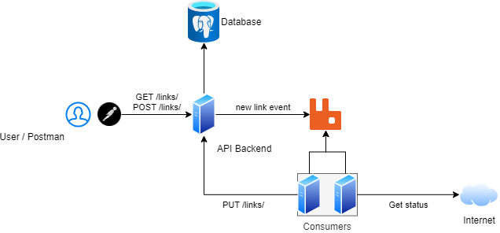

# Проектирование и разработка распределенных программных систем

Лекции и материалы по курсу распределенных систем в ЧелГУ, группа ПрИ-401.

## Лекции

### Лекция 1. Введение в распределенные системы

[Презентация](https://docs.google.com/presentation/d/1_ZhULEapqhi_SoFBBiN6KEndFg5a-0eU/edit?usp=sharing&ouid=101402898313988385194&rtpof=true&sd=true)

Зачем нужны распределенные системы, какие проблемы они решают и какие проблемы в них появляются.

**Ссылки**
1. Мартин Клеппман. Высоконагруженные приложения. Программирование, масштабирование, поддержка
2. [Лекции Мартина Клеппмана по распределенным системам в Кембридже](https://martin.kleppmann.com/2020/11/18/distributed-systems-and-elliptic-curves.html)
3. [Distributed systems for fun and profit](http://book.mixu.net/distsys/)
4. [Страх и ненависть в распределённых системах](https://habr.com/ru/post/322876/)

### Лекция 2. Асинхронное программирование

[Презентация](https://docs.google.com/presentation/d/1kOvnsjf9KK6eG8QuuBi3NLGT4lwD379G/edit?usp=sharing&ouid=101402898313988385194&rtpof=true&sd=true)

**Ссылки**
1. [Highload++ для начинающих](http://highload.guide/blog/highload-for-beginners.html)
2. [Анатомия веб-сервиса](http://highload.guide/blog/inside-webserver.html)
3. [Метафоры асинхронности в документации FastAPI](https://fastapi.tiangolo.com/async/)
4. [Асинхронщина в JS](https://habr.com/ru/company/oleg-bunin/blog/417461/)

### Лекция 3. Модели данных

[Презентация](https://docs.google.com/presentation/d/1S9la8f8GlVnoReuls-GyysM92LhLMtnj/edit?usp=sharing&ouid=101402898313988385194&rtpof=true&sd=true)

Реляционные, документоориентированные, графовые, key-value и колоночные БД.

**Ссылки**
1. [NoSQL – коротко о главном](https://habr.com/ru/company/oleg-bunin/blog/319052/)
2. Мартин Клеппман. Высоконагруженные приложения. Программирование, масштабирование, поддержка. Глава 2
3. [CQRS documents](https://cqrs.files.wordpress.com/2010/11/cqrs_documents.pdf)

### Лекция 4. Коммуникация приложений

[Презентация](https://docs.google.com/presentation/d/1HKD3JvyAC-MgITIaAZ6A0aEMKXmGw229/edit?usp=sharing&ouid=101402898313988385194&rtpof=true&sd=true)

**Ссылки**
1. Хоп Грегор, Вульф Бобби. Шаблоны интеграции корпоративных приложений
2. Сэм Ньюмен. Создание микросервисов, глава 4

### Лекция 5. Очереди сообщений

[Презентация](https://docs.google.com/presentation/d/1pPbSGKekU2Tz8CEU6esyRFDst8J-xchH/edit?usp=sharing&ouid=101402898313988385194&rtpof=true&sd=true)

**Ссылки**
1. [Принципы и приёмы обработки очередей](https://habr.com/ru/company/oleg-bunin/blog/309332/)
2. [101 способ приготовления RabbitMQ и немного о pipeline архитектуре](https://habr.com/ru/company/oleg-bunin/blog/310418/)
3. [Очереди и блокировки. Теория и практика](https://habr.com/ru/company/oleg-bunin/blog/316458/)

### Лекция 6. Горизонтальное масштабирование

[Презентация](https://docs.google.com/presentation/d/1H7Ghkkom0YKBzbMG2pVOGzGBfX6oMU9b/edit?usp=sharing&ouid=101402898313988385194&rtpof=true&sd=true)

**Ссылки**
1. [Общая логика масштабирования](http://highload.guide/blog/scaling-logic.html)
2. [Масштабирование бэкенда](https://xakep.ru/2012/11/30/backend-zoom/)
3. [Горизонтальное масштабирование. Что, зачем, когда и как](http://highload.guide/blog/scaling-what-why-when-and-how.html)
4. [Как мы сделали ровную балансировку нагрузки на фронтенд-кластере](http://highload.guide/blog/load-balancing-frontend-cluster.html)

### Лекция 7. Кэширование

[Презентация](https://docs.google.com/presentation/d/1qNaufc3luI85ihppWIMHQLF7O8rmc6Io/edit?usp=sharing&ouid=101402898313988385194&rtpof=true&sd=true)

**Ссылки**
1. [Web, кэширование и memcached](http://highload.guide/blog/web-caching-memcached.html)
2. [Кэширование данных в web приложениях. Использование memcached](http://highload.guide/blog/caching-data-in-web-applications.html)
3. [Использование memcached и Redis в высоконагруженных проектах](http://highload.guide/blog/using-memcached-and-redis.html)

### Лекция 8. Масштабирование БД

[Презентация](https://docs.google.com/presentation/d/1ve0-cLZU3W7CxDCjlFm-WRrjSTkqmuAv/edit?usp=sharing&ouid=101402898313988385194&rtpof=true&sd=true)

**Ссылки**
1. Мартин Клеппман. Высоконагруженные приложения. Программирование, масштабирование, поддержка. Главы 5, 6
2. [Шардинг: паттерны и антипаттерны](https://habr.com/ru/company/oleg-bunin/blog/313366/)

## Практика

### Практика 0. Проектирование архитектуры системы

**Задание**  
Спроектировать архитектуру большой высоконагруженной системы.

**Ссылки**
1. [Awesome Software Architecture](https://awesome-architecture.com/)
2. [The C4 model for visualising software architecture](https://c4model.com/)
3. [The System Design Primer](https://github.com/donnemartin/system-design-primer)

### Практика 1. Контейнеризация и Docker

[Презентация](https://docs.google.com/presentation/d/1DhlC-KHJziMR-z2Bu9zcauJnXVLrObww/edit?usp=sharing&ouid=101402898313988385194&rtpof=true&sd=true)

**Задание**
1. Написать  веб-сервер, который принимает HTTP-запрос и отдает ответ «Hello world»
2. Установить Docker
3. Написать Dockerfile и запустить веб-сервер в докер-контейнере так, чтобы к нему можно было обратиться с хост-машины

**Ссылки**
1. [Установка Docker](https://docs.docker.com/get-docker/)
2. [Документация по Docker](https://docs.docker.com/get-started/)
3. [Документация по Dockerfile](https://docs.docker.com/engine/reference/builder/)
4. [Порядок команд в Dockerfile](https://medium.com/@esotericmeans/optimizing-your-dockerfile-dc4b7b527756)
5. [Multi-stage builds для компилируемых языков](https://docs.docker.com/develop/develop-images/multistage-build/)

### Практика 2. Взаимодействие контейнеров

[Презентация](https://docs.google.com/presentation/d/1o4RF5xkRcu9wWj3eXU6OWDGu6gNI1yCF/edit?usp=sharing&ouid=101402898313988385194&rtpof=true&sd=true)

**Задание**
1. Дописать приложение, чтобы оно содержало два эндпоинта
  * POST /links — сохраняет ссылку в БД и возвращает ее id
  * GET /links/<id> — отдает ссылку из БД по id
2. Добавить контейнер с PostgreSQL и настроить его взаимодействие с приложением
3. Настроить запуск обоих контейнеров через Docker Compose

**Ссылки**
1. [12-факторное приложение](https://12factor.net/)
2. [Postgres по Docker Hub](https://hub.docker.com/_/postgres)
3. [Сеть в Docker](https://docs.docker.com/network/network-tutorial-standalone/)
4. [Volumes в Docker](https://docs.docker.com/storage/volumes/)
5. [Docker Compose](https://docs.docker.com/compose/)
6. [Документация по docker-compose.yml](https://docs.docker.com/compose/compose-file/)

 
### Практика 3. Работа с RabbitMQ

[Презентация](https://docs.google.com/presentation/d/1oWZIO97veA2Kg0duYmmxjr_WRnL5d4Tk/edit#slide=id.p1)

**Задание**
1. Добавить контейнер с RabbitMQ
2. В приложении добавить в модель ссылки поле «статус», добавить эндпоинт PUT /links/<id> для обновления статуса ссылки. При добавлении ссылки отправлять ее в очередь сообщений
3. Добавить консьюмер, который слушает очередь сообщений и получает все новые ссылки, делает запрос к ним и сохраняет HTTP-статус ответа через новый эндпоинт приложения. 

**Ссылки**
1. [RabbitMQ на Docker Hub](https://hub.docker.com/_/rabbitmq)
2. [Тьюториал по RabbitMQ](https://www.rabbitmq.com/getstarted.html)
3. [Healthchecks в docker-compose](https://stackoverflow.com/questions/31746182/docker-compose-wait-for-container-x-before-starting-y )

 
### Практика 4. Балансировка нагрузки через nginx

[Презентация](https://docs.google.com/presentation/d/1IiAbJeQxnoM8iRmBfDJMzFtDL6mdC1_b/edit?usp=drive_web&ouid=101402898313988385194&rtpof=true)

**Задание**
1. Поднять два отдельных контейнера с API. Каждый из них должен добавлять в ответ собственную метку, чтобы было понятно, какой из контейнеров ответил (например, через HTTP-хедер)
2. Поднять контейнер с nginx, который проксирует запросы на API-контейнеры и балансирует нагрузку между ними

**Ссылки**
1. [nginx на Docker Hub](https://hub.docker.com/_/nginx)
2. [Документация по nginx](http://nginx.org/ru/docs/beginners_guide.html)
3. [Балансировка нагрузки в nginx](http://nginx.org/en/docs/http/load_balancing.html)
 

### Практика 5. Кэширование в Redis

Презентация

**Задание**
1. Добавить контейнер с Redis
2. Добавить в коде консьюмера использование Redis в качестве кэша для ответов от внешних сервисов

**Ссылки**
1. [Redis на Docker Hub](https://hub.docker.com/_/redis)
2. [Документация по Redis (введение)](https://redis.io/topics/data-types-intro)

## Итоговая оценка
 
### Баллы за практические задачи

| Дата сдачи  | Архитектура | Docker | БД | RabbitMQ | nginx | Redis |
|-------------|-------------|--------|----|----------|-------|-------|
|  5 октября      |      20     |      - |  - |        - |     - |     - |
| 11 октября      |      20     |     20 |  - |        - |     - |     - |
| 18 октября      |      20     |     20 | 20 |        - |     - |     - |
| 25 октября      |      20     |     20 | 20 |       20 |     - |     - |
|   1 ноября      |      15     |     20 | 20 |       20 |    20 |     - |
|   8 ноября      |      15     |     20 | 20 |       20 |    20 |    20 |
|  14, 16 ноября  |      15     |     20 | 20 |       20 |    20 |    20 |
|  22 ноября      |      15     |     15 | 20 |       20 |    20 |    20 |
|  28, 30 ноября  |      15     |     15 | 15 |       20 |    20 |    20 |
|   6 декабря     |      10     |     10 | 15 |       15 |    20 |    20 |
|  12, 14 декабря |      10     |     10 | 10 |       15 |    15 |    20 |
|  20 декабря     |      5      |      5 |  5 |        5 |    10 |    15 |
|  26, 28 декабря |      5      |      5 |  5 |        5 |    10 |    15 |
 
5 из 6 практик сданы: **+100**
 
### Перевод баллов в оценку
 
| От  | До  | Оценка |
|-----|-----|--------|
| 140 | 160 |  **3** |
| 160 | 180 |  **4** |
| 180 | 220 |  **5** |

[Таблица с баллами](https://docs.google.com/spreadsheets/d/1sy2L86f_eOMos7ZFztNh37OzXXNVGcwz65WYLJ6sMvk/edit#gid=0)
 
 
## Курсовые работы
 
[Презентация](https://docs.google.com/presentation/d/1q-PEwKRXLEUKs74-ODpbnT9OwYc_FOly/edit?usp=sharing&ouid=101402898313988385194&rtpof=true&sd=true)
